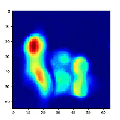

# lantern-sandbox

Repository for experimenting with neural implicit models for scene representation. The idea behind this project is to build continual learning models capable of fitting scenes **in real-time**, like [iMAP](https://edgarsucar.github.io/iMAP/), but with support for inputs other than images (e.g., LIDAR).
                                                      
<br/>
<div align="center">
    
    <br/>
    <span>The implicit representation of a bunny supervised by depth images rendered from a mesh</span>
</div>
<br/>

As of now, the model is capable of reasonably fitting simple scenes, as shown below, with 3D supervision only. However, it is too unstable and, depending on the number of viewpoints being fed to the model, as well as on parameters such as the number of rays per viewpoint, number of samples along each ray, etc, training can require an amount of memory that makes its application in mobile devices quite challenging.

A suggestion for future works is to explore alternative approaches to encoding geometry and appearance that do not require sampling the rays and evaluating the network for each sample.

# Getting started

1. Install `conda`

2. Create a new conda environment:

```bash
conda env create --file ./environment.yml
```

3. Activate the conda environment:
```bash
conda activate lantern
```

4. Run scripts for testing:
```bash
# Train model to fit a function based on synthetic data
python ./scripts/function.train.py

# Evaluate model
python ./scripts/mesh.demo.py
```

```bash
# Use PyTorch to render depth and intensity from a mesh 
python ./scripts/mesh.demo.py

# Use PyTorch to render depth and intensity from a point cloud 
python ./scripts/mesh.demo.py
```

```bash
# Train an implicit model to fit a 3D mesh based on synthetic renderings generated random viewpoints 
python ./scripts/mesh.train.py
```

# Developing

This repository is organized as a Python module and a bunch os scripts corresponding to experiments that can be executed, and that rely on the aforementioned module.

In the very beginning of every script, you'll see that the following:

```python
import context
```

This sets the Python path so that the scripts are able to import things from within the `lantern` module. Make sure this is always included in any new file you create.

# References
This project borrows some ideas and organizational concepts mainly from [Vincent Sitzmann's implementation of SIREN](https://vsitzmann.github.io/siren/) and [Pytorch3D`s implementation of NeRF](https://github.com/facebookresearch/pytorch3d).
